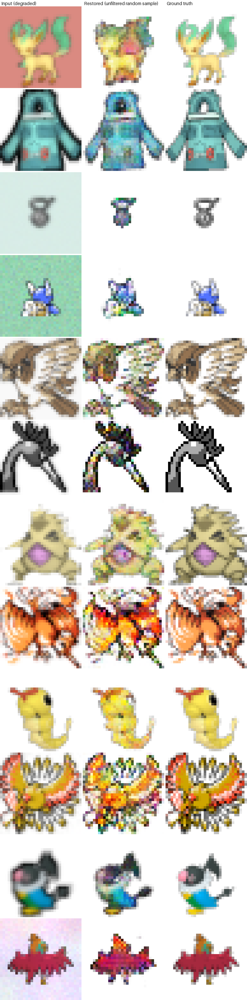
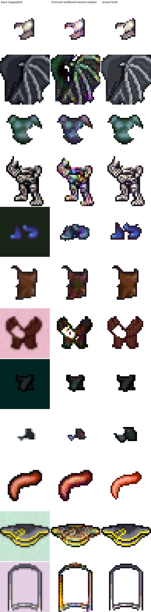
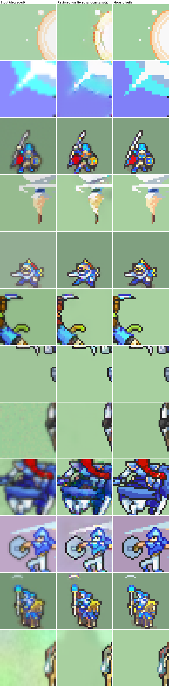
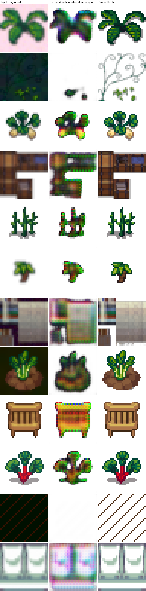
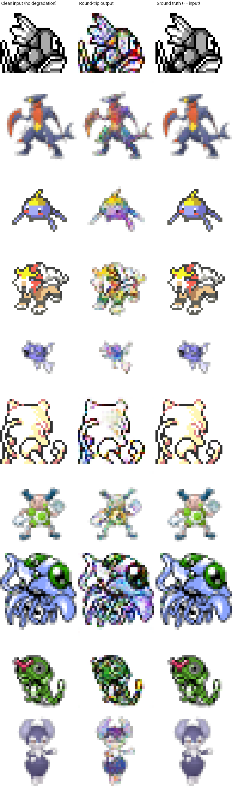
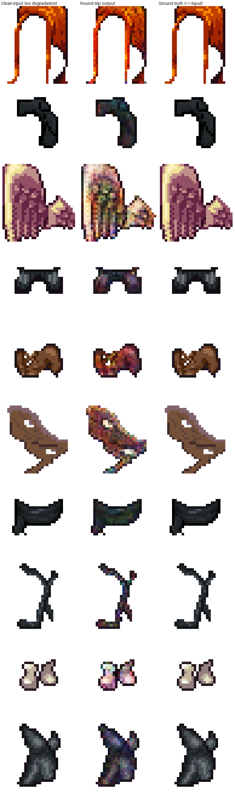
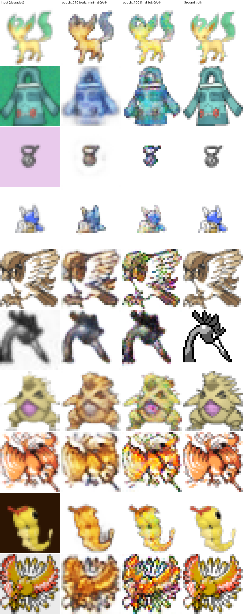
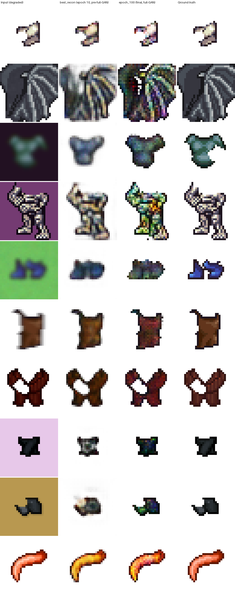

# Random pool samples — unbiased visual check, per source

**Why this doc exists:** the per-source `eval_grid.png` files use a small (20-image) held-out
test set. Given this session already found that held-out sets can themselves be
unrepresentative or corrupted (see
[2026-07-08-data-pipeline-investigation.md](2026-07-08-data-pipeline-investigation.md)), a
20-image PSNR number isn't enough to trust on its own — it can look better without the model
actually being better. This doc instead samples directly and randomly from each source's full
training pool (thousands to tens of thousands of images, not 20), with **no filtering for
"looks good"** — this is the opposite intent from `SHOWCASE.md`, which deliberately curates
recognizable examples for a friendly demo. Here the point is an honest, unfiltered read.

Generated by `scripts/build_random_pool_samples.py`. Re-run it any time for a fresh draw.

## papi (PokéAPI)

**Honest read:** roughly half of this random 12-sample draw is solid — simple, large-flat-area
creatures reconstruct cleanly. But a real fraction (not an edge case — about half) show
**heavy rainbow/multicolor speckle noise**, well beyond cosmetic, on detailed or
high-frequency content: fine feather patterns, scalework, spiky silhouettes. The PSNR
improvement from the scraper fixes (18.82 → 21.31 dB) is real, but it reflects the data
quality fix (whole, correctly-scaled creatures instead of zoomed fragments), **not** a fix to
this speckle problem, which is a separate, still-open issue in the model itself. Calling this
"quite bad" for the detailed cases is fair.

## lpc (Universal LPC)

**Honest read:** same failure pattern as `papi`, not a source-specific issue. Of this
12-image random draw: roughly 5-6 show heavy rainbow/multicolor speckle — worst on the
detailed dragon-wing (row 2, fine feather-line structure almost entirely lost to noise), the
scale-textured quadruped armor (row 4), and the crossed maroon gauntlets (row 7, corrupted
toward green/black, far from GT's clean maroon). A handful are moderate (visible but not
dominant noise — the brown vest, the small black armor piece). Only 1-2 (the blue boots) are
genuinely clean. Same conclusion as `papi`: detail/high-frequency content is what triggers
the corruption, independent of which source it came from — consistent with the capacity/GAN
hypothesis in the methodology review rather than anything specific to LPC's data.

## fe (Fire Emblem GBA battle sprites)

**Honest read: noticeably cleaner than papi/lpc, not just marginally.** Across this 12-image
random draw, none of the samples show the heavy rainbow/multicolor speckle that dominated
roughly half of papi's and lpc's random pools — including on genuinely detailed content (the
mounted cavalier in row 11, the red-caped knight in row 9, both have real fine detail and
came out close to ground truth with mild softening, not corruption). The knight/soldier
sprites (rows 3, 5, 8, 10) are close to indistinguishable from GT at this zoom level.

**This is backed by the D3 speckle metric, not just eyeballing** (per the standing rule
about not trusting a visual impression alone): computed on the identical seed=99 sample
selection used for all three sources' random-pool draws —

| source | mean speckle score (12 samples, seed=99) |
|---|---|
| papi | 0.002565 |
| lpc | 0.000517 |
| fe | 0.000248 |

fe is roughly **10x lower than papi** and about half of lpc's. This is a real, measured
difference between sources trained with the identical model architecture, loss, and Stage 2
degradation pipeline — so it isn't explained by anything in this session's methodology
fixes; it has to come from something about the data itself.

**Why fe might look cleaner — stated as hypotheses, not confirmed conclusions:**
- fe's dataset is the largest of the three (49,125 images vs. papi's 20,604 and lpc's
  23,010) — more training signal per epoch could mean better per-region fit even with the
  same 512-code, 16x16-latent capacity ceiling.
- fe sprites (official Fire Emblem GBA battle animation frames) come from a single game's
  consistent, professionally-produced art style — less stylistic diversity than papi
  (thousands of independently-designed Pokemon) or lpc (a community asset pack with many
  contributors' styles mixed together). Less diversity to represent with a fixed-size
  codebook could mean less pressure on the "under-capacity" failure mode identified in the
  methodology review.
- fe sprites are opaque (no alpha matte) — removes one source of edge-region difficulty
  (alpha-boundary noise) that papi/lpc's transparent sprites have to handle.
- fe's color regions tend to be larger and blockier (armor plates, capes) versus papi's fine
  scale/feather textures or lpc's detailed dragon-wing linework — consistent with the
  already-established pattern that speckle correlates with GT high-frequency content, not
  degradation severity.

None of these are verified here — they're plausible explanations consistent with the D1/D2/D3
diagnostics already run, not new evidence on their own. Worth keeping in mind for Stage 3:
if fe's better result is really about data homogeneity/scale rather than anything
architectural, that's a data-composition lever, separate from the capacity/GAN levers already
identified.

## oga (OpenGameArt humanoid + environment/furniture/plants)

**Honest read: this is the worst of the four sources, clearly and by a wide margin — not a
close call.** Several samples are effectively destroyed: the decorative vine (row 2) lost
its entire fine linework and collapsed to a blob; the interior floor tile (row 4), fabric
pattern (row 7), wooden chair (row 9), and diagonal fence pattern (row 11, which came out
nearly blank/white, not just noisy) are all barely recognizable against their ground truth.
A handful of simpler, flatter plant shapes (rows 5, 8, roughly) held up reasonably. This is
not "some speckle on detailed content" like papi/lpc/fe — several samples are outright
reconstruction failures.

**D3 speckle metric, same seed=99 methodology as the other three sources:**

| source | mean speckle score (12 samples, seed=99) | dataset size |
|---|---|---|
| fe | 0.000248 | 49,125 |
| lpc | 0.000517 | 23,010 |
| papi | 0.002565 | 20,604 |
| **oga** | **0.016882** | **932** |

oga's mean speckle is roughly **68x higher than fe, 33x higher than lpc, and 6.6x higher
than papi** — not a marginal difference, a different regime entirely. Per-sample scores are
also highly bimodal (three samples above 0.026, several others near zero) rather than
uniformly bad, consistent with the visual read that simple/flat content survives while
detailed/textured content fails hard.

**Most likely cause, stated as the leading hypothesis, not a certainty:** oga's dataset is
932 images — 20-50x smaller than the other three sources. This was flagged as a risk when
oga was curated (a hand-picked OpenGameArt collection, not scraped at scale like the other
sources) but not something this session tested for before now. Combined with the fact that
oga's content (interior tiles, wood-grain furniture, fine decorative vines and fence
patterns) is inherently higher-frequency/more repetitive-textured than character sprites —
exactly the failure mode already established to correlate with speckle — the small dataset
likely compounds rather than causes the problem on its own. Both a genuinely small-data
issue and a content-difficulty issue point the same direction here, so it's hard to
separate them cleanly from 12 samples.

**Implication:** oga is not currently usable in its present form for the stated "furniture,
plants, ground" use case — the exact category of content this source was curated for is
the category failing hardest. This doesn't change the Stage 3 priority (palette-index
classification, Option A, is still the primary recommendation and doesn't depend on this
finding), but if oga content specifically matters for the upcoming game, more source data
for this category should be treated as a real, separate need — not something the
architectural fixes already planned are likely to solve on their own given the scale of the
gap here.

---

## Diagnostics (from the methodology review — see plan file)

Two cheap, checkpoint-only diagnostics run against the finished `papi`/`lpc` v2 models to
figure out *why* the speckle happens, not just confirm that it does.

### D1 — clean round-trip (decides whether Method 6 / MaskGIT is viable)

`scripts/diagnostic_d1_roundtrip.py` — feeds **undegraded** clean sprites straight through
encode→quantize→decode (`apply_degradation=False`, so input literally equals target). No
inversion task at all; this isolates the autoencoder itself.

**Result: unambiguous.** Heavy rainbow speckle appears even here (papi rows 1, 4, 6; lpc
rows 3, 6) — on the model's own undegraded training data, with nothing to invert. **This
settles the Method 6 question from the master plan.** MaskGIT only replaces the prior over
token *selection*; the frozen decoder that turns tokens into pixels is unchanged, and that
decoder cannot render detailed pixel art cleanly under any circumstances tested. Building a
transformer on top of this autoencoder would inherit the identical speckle. Phase 6 as
originally specified is not a fix.

### D2 — GAN ablation (early vs. final checkpoint, same samples)

`scripts/diagnostic_d2_gan_ablation.py` — compares an early checkpoint (pre-/just-at the
start of the adversarial ramp) against the final `epoch_100` (full adversarial weight), on
identical degraded-input samples.

**Result: consistent, real effect, but a genuine tradeoff, not a free win.** On detailed
content (papi: the feathered bird row 5, the bird-creature row 10; lpc: the dragon wing row
2, the scale-textured armor row 4), the early checkpoint is **dramatically less speckled**
than the final one. But it isn't simply better — the early checkpoint achieves this by being
*blurrier*, losing fine detail outright rather than rendering it noisily. The final
(full-GAN) checkpoint has more actual detail but a meaningful fraction of it is corrupted
into rainbow noise.

This points at the adversarial loss as a **real, testable lever**: `train.py` uses a fixed
`adv_weight=1.0` with no adaptive balancing (the original VQGAN paper uses a
gradient-ratio-adaptive λ, typically effective ≪ 1). The model is trading reconstruction
fidelity for discriminator-pleasing texture, and at 32×32 that trade *is* the speckle.
Worth noting: `papi`'s `training_log.csv` recon-loss curve doesn't show the old "spikes and
never recovers" pattern from the first (v1) marathon — it improves smoothly through the GAN
ramp (0.91 → 0.81) — yet the visual speckle is still clearly worse at the end. **The
aggregate recon-loss metric is not a reliable proxy for this failure mode**; a real speckle
metric (D3, in progress) is needed so future comparisons don't rely on eyeballing grids.

### D3 — a real speckle metric (so future comparisons aren't eyeballing grids)

`compute_speckle_score` (`spriteforge/train/evaluate.py`): for every pixel whose ground-truth
3×3 neighborhood is nearly flat (real sprites are mostly flat regions), measure the local
variance of the *prediction* there. Higher = more speckle. Vectorized via box-filter moments
(`cv2.blur`), not a per-pixel loop. 5 unit tests in `tests/test_evaluate.py` (zero for
identical/flat-vs-flat images, high for salt-and-pepper noise, zero on genuinely detailed GT
regions — it only scores where GT says "this should be flat," so it can't penalize the model
for real fine detail — and a monotonicity check). Wired into both `evaluate_checkpoint`
(full held-out metrics) and the per-epoch training CSV (first batch of each epoch only, to
keep the overhead cheap on large datasets).

**Validated against the D2 samples directly** (same 10 images, same seed): mean speckle score
0.00111 (epoch_010) vs 0.00134 (epoch_100) — about 21% higher on the full-GAN checkpoint,
correctly matching the direction seen visually. Worth being honest about the metric's limits
though: it's noisy at the *individual*-sample level (one sample scored lower on the
supposedly-worse final checkpoint) — this is a decent v1 aggregate signal for comparing runs,
not a precise per-image instrument. Good enough to stop eyeballing grids for every
future comparison; not good enough to trust a single-image score in isolation.

### What this means for the plan's options (Part 3)

- **Option B (tame the GAN)** now has direct evidence behind it, not just theory — worth
  doing regardless of what else happens, cheap to test (lower `adv_weight`, or an adaptive
  lambda).
- **Option A (palette-index classification)** remains the strongest structural fix: D1
  shows the continuous decoder can paint arbitrary off-palette noise even with zero GAN
  pressure and zero degradation, which no amount of adversarial-weight tuning fully
  eliminates by itself (the early checkpoint is *less* speckled but still not clean, and
  it's blurry).
- **Option C (Method 6 variant)** — D1 confirms the precondition fails. Deprioritized.

## What this suggests about the speckle problem

Looking specifically at which examples are bad vs. good in the papi sample: the pattern isn't
random. Detailed/high-frequency sprites (fine linework, feather/scale texture, many small
distinct color regions) corrupt heavily; simple sprites with a few large flat color regions
reconstruct cleanly. That's consistent with what `SHOWCASE.md`'s "color cleanup trick" section
already described as the model's core weakness — but this random sample makes clear it's not
a minor finishing touch, it's the dominant failure mode on a meaningful fraction of real
content. Worth prioritizing over further data-pipeline work at this point: the codebook/loss
function, not the training data, is now the likely bottleneck.
