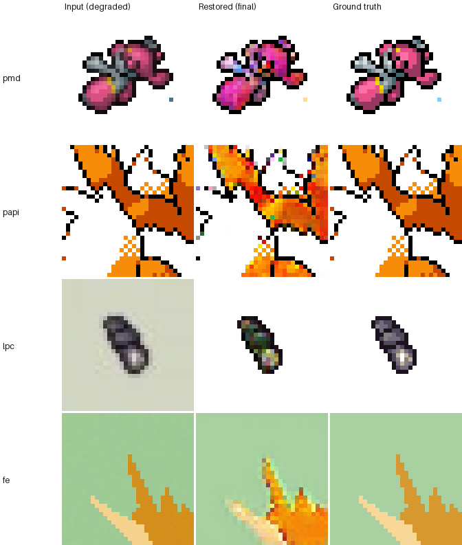
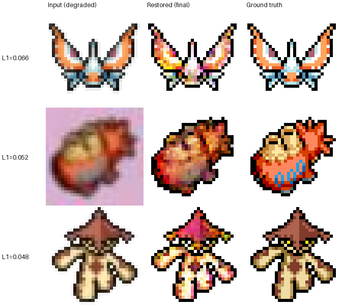
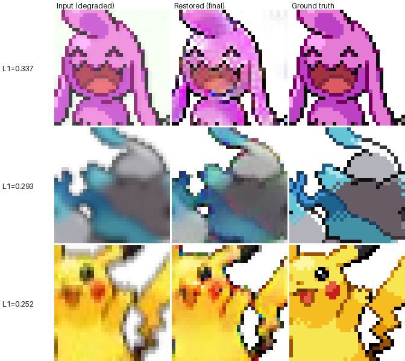
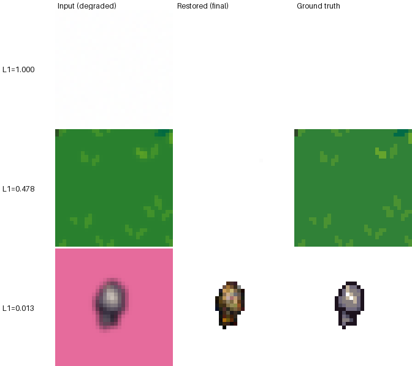
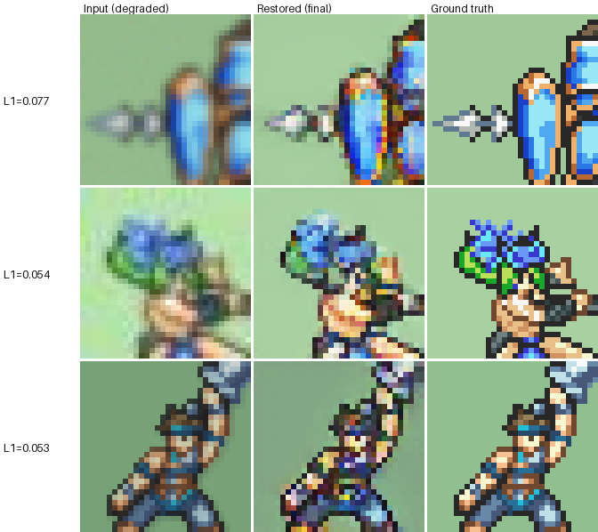

# Spriteforge — Multi-Source Training Review

Generated: 2026-07-08 10:29

Each source below was trained independently for 100 epochs from scratch (config `size_32`, `--disc-start 10 --adv-ramp-epochs 20` — adversarial loss ramps in linearly over epochs 10-30 instead of switching on instantly, to avoid destabilizing reconstruction), then evaluated against a held-out per-source test set (20 images, not seen in training). A `vqgan_32_best_recon.pt` checkpoint is also saved per source, tracking the lowest-recon-loss epoch seen.

**Data-quality notes:** two of the four held-out eval sets shipped with this repo turned out to be corrupted and were rebuilt from the real training distribution before trusting these numbers. `test_pmd_32` (original) contained dialogue/status-screen crops with baked-in caption text and no alpha transparency — replaced by `test_pmd_32_clean`. `test_fe_32` contained isolated letter/logo fragments from a mis-sliced trademark watermark (3/20 images) — replaced by `test_fe_32_clean`. Both were caught by visually inspecting eval grids where PSNR looked anomalous relative to training loss, not by the metrics alone — a reminder to spot-check images, not just numbers, when eval results look off.

## At a glance

One random held-out example per source (input / restored / ground truth):

## Summary

| Source | PSNR (dB) | L1 loss | Codebook usage | Active codes |
|---|---|---|---|---|
| pmd | 21.44 | 0.027 | 0.9395 | 481/512 |
| papi | 18.82 | 0.0809 | 0.9688 | 496/512 |
| lpc | 24.96 | 0.0817 | 0.6855 | 351/512 |
| fe | 25.1 | 0.0274 | 0.834 | 427/512 |

---

## Key finding: palette-snap post-processing helps *visually*, not always *numerically*

Per-source sections below embed a palette-snap comparison: the model's continuous RGBA output run through `extract_palette_kmeans` (k=6, OKLab space) + `nearest_neighbor_snap` (`spriteforge/core/palette.py`) — the same deterministic post-processing Stage A already does for raw-image conversion, applied here to Stage B's neural output. Two palette sources are shown: inferred from the degraded input (realistic — the only thing available at real inference time) and from the ground truth (a ceiling, using color info you would never actually have).

**Visually**, snapping consistently removes the speckled/muddy color noise that is the raw VQ-GAN output's most obvious flaw — see any of the grids below, e.g. `pmd` row 1 or row 4, where a noisy multi-color speckle field collapses into a clean, flat, sprite-like fill.

**Numerically, it's mixed.** A k-sweep on `pmd` (raw model L1 ≈ 0.026-0.030 depending on run):

| Palette source | k=6 | k=12 | k=16 | k=24 |
|---|---|---|---|---|
| From degraded input (realistic) | 0.0327 | 0.0305 | 0.0296 | 0.0310 |
| From model's own output (self) | 0.0275 | 0.0299 | 0.0280 | — |
| From ground truth (ceiling) | 0.0249 | 0.0292 | 0.0235 | — |

Only the ground-truth-derived palette reliably *beats* raw output on L1, at every k tested. Snapping from the degraded input never wins — the input's own colors are already corrupted by blur/noise/jitter, so a palette extracted from it inherits that corruption and compounds it. Snapping from the model's *own* output sits in between: close to break-even, better than snapping from the raw input, because the model's output is already partially denoised.

**Practical takeaway:** palette-snapping is worth keeping as a Stage A-style post-process for the visual cleanup alone, but for the best numerical result without cheating via ground truth, snap using a palette extracted from the *model's own restored output* (not the raw input) at a moderate k (12-16), not k=6.

### Fixed pre-defined palette (the real production case)

`scripts/build_review_examples.py --palette-file <path>` snaps every restored output to a single pre-defined palette instead of auto-inferring one per image — this is how the shipped pipeline should actually run once a real target palette exists. The assets below used `spriteforge/data/palettes/pico8.json` (16 colors) as a stand-in — **swap in your actual production palette file to get meaningful numbers**; PICO-8's colors have no relation to any of these sprite domains and this is expected to look worse than the auto-inferred columns.

| Source | Raw L1 | Auto-snap L1 | Fixed-palette L1 |
|---|---|---|---|
| pmd | 0.028 | 0.0321 | 0.033 |
| papi | 0.1086 | 0.1107 | 0.1415 |
| lpc | 0.08 | 0.0799 | 0.0819 |
| fe | 0.0299 | 0.0416 | 0.0912 |

**This is the key caveat for real deployment:** a fixed palette only helps if it's actually representative of the sprite domain's true colors. An unrelated palette (like PICO-8 here) doesn't collapse the model's color speckle noise the way an in-domain palette does — nearby true colors land on different, still-wrong palette entries, so the speckle persists (see the grids below, "Snap (fixed palette)" column). Before shipping this against a real predefined palette, regenerate these grids with it and confirm the same collapse-to-clean-fill effect actually happens.

---

## pmd — PMDCollab (Pokémon Mystery Dungeon)

**Training curve (from training_log.csv):**

- Epochs logged: 100 (final epoch 100)
- Loss G: 1.6016 → 1.8106
- Loss D: 0.0 → 0.9107
- Recon loss: 1.5918 → 1.4346
- VQ loss: 0.0097 → 0.2143
- Orthogonality metric: 360.0376 → 259.0205 (lower = healthier codebook)
- Active codes: 512 → 512 / 512 total

**Held-out eval metrics:**

- PSNR: 21.44 dB
- L1 loss: 0.027
- Codebook usage: 0.9395 (481/512 codes active on eval set)

**Randomly selected examples** (input / restored-final / restored-best-recon / ground truth — regenerate with `scripts/build_review_examples.py` for a fresh draw):

**Palette-snap post-processing** (input / restored / snap-fixed-palette / snap-auto-from-input / snap-auto-from-GT-ceiling / ground truth — see "Key finding" above):

- Full held-out set (20 images), raw model L1: 0.028 vs. auto palette-snap (k=6, from input) L1: 0.0321 vs. fixed-palette snap L1: 0.033

**Worst cases** (highest per-image L1 error against the final checkpoint):

**Artifacts:**
- Checkpoints: `checkpoints_bysource/pmd/vqgan_32_epoch_*.pt`
- Full per-epoch log: `checkpoints_bysource/pmd/training_log.csv`
- Sample grids (10 saved): `checkpoints_bysource/pmd/samples/`
- Eval comparison grid: `checkpoints_bysource/pmd/eval_grid.png`

---

## papi — PokeAPI overworld/icon sprites

**Training curve (from training_log.csv):**

- Epochs logged: 100 (final epoch 100)
- Loss G: 2.2471 → 1.9954
- Loss D: 0.0 → 0.8411
- Recon loss: 2.2236 → 1.4634
- VQ loss: 0.0235 → 0.2202
- Orthogonality metric: 388.3816 → 276.9565 (lower = healthier codebook)
- Active codes: 512 → 512 / 512 total

**Held-out eval metrics:**

- PSNR: 18.82 dB
- L1 loss: 0.0809
- Codebook usage: 0.9688 (496/512 codes active on eval set)

**Randomly selected examples** (input / restored-final / restored-best-recon / ground truth — regenerate with `scripts/build_review_examples.py` for a fresh draw):

**Palette-snap post-processing** (input / restored / snap-fixed-palette / snap-auto-from-input / snap-auto-from-GT-ceiling / ground truth — see "Key finding" above):

- Full held-out set (20 images), raw model L1: 0.1086 vs. auto palette-snap (k=6, from input) L1: 0.1107 vs. fixed-palette snap L1: 0.1415

**Worst cases** (highest per-image L1 error against the final checkpoint):

**Artifacts:**
- Checkpoints: `checkpoints_bysource/papi/vqgan_32_epoch_*.pt`
- Full per-epoch log: `checkpoints_bysource/papi/training_log.csv`
- Sample grids (10 saved): `checkpoints_bysource/papi/samples/`
- Eval comparison grid: `checkpoints_bysource/papi/eval_grid.png`

---

## lpc — Universal LPC modular humanoids

**Training curve (from training_log.csv):**

- Epochs logged: 100 (final epoch 100)
- Loss G: 1.3935 → 1.7171
- Loss D: 0.0 → 0.9052
- Recon loss: 1.3914 → 1.7163
- VQ loss: 0.0021 → 0.0816
- Orthogonality metric: 438.1942 → 272.859 (lower = healthier codebook)
- Active codes: 512 → 512 / 512 total

**Held-out eval metrics:**

- PSNR: 24.96 dB
- L1 loss: 0.0817
- Codebook usage: 0.6855 (351/512 codes active on eval set)

**Randomly selected examples** (input / restored-final / restored-best-recon / ground truth — regenerate with `scripts/build_review_examples.py` for a fresh draw):

**Palette-snap post-processing** (input / restored / snap-fixed-palette / snap-auto-from-input / snap-auto-from-GT-ceiling / ground truth — see "Key finding" above):

- Full held-out set (20 images), raw model L1: 0.08 vs. auto palette-snap (k=6, from input) L1: 0.0799 vs. fixed-palette snap L1: 0.0819

**Worst cases** (highest per-image L1 error against the final checkpoint):

**Artifacts:**
- Checkpoints: `checkpoints_bysource/lpc/vqgan_32_epoch_*.pt`
- Full per-epoch log: `checkpoints_bysource/lpc/training_log.csv`
- Sample grids (10 saved): `checkpoints_bysource/lpc/samples/`
- Eval comparison grid: `checkpoints_bysource/lpc/eval_grid.png`

---

## fe — Fire Emblem GBA battle sprites (opaque bg)

**Training curve (from training_log.csv):**

- Epochs logged: 100 (final epoch 100)
- Loss G: 1.4351 → 0.9461
- Loss D: 0.0 → 0.8255
- Recon loss: 1.4256 → 0.5189
- VQ loss: 0.0095 → 0.1104
- Orthogonality metric: 474.5111 → 260.328 (lower = healthier codebook)
- Active codes: 512 → 512 / 512 total

**Held-out eval metrics:**

- PSNR: 25.1 dB
- L1 loss: 0.0274
- Codebook usage: 0.834 (427/512 codes active on eval set)

**Randomly selected examples** (input / restored-final / restored-best-recon / ground truth — regenerate with `scripts/build_review_examples.py` for a fresh draw):

**Palette-snap post-processing** (input / restored / snap-fixed-palette / snap-auto-from-input / snap-auto-from-GT-ceiling / ground truth — see "Key finding" above):

- Full held-out set (20 images), raw model L1: 0.0299 vs. auto palette-snap (k=6, from input) L1: 0.0416 vs. fixed-palette snap L1: 0.0912

**Worst cases** (highest per-image L1 error against the final checkpoint):

**Artifacts:**
- Checkpoints: `checkpoints_bysource/fe/vqgan_32_epoch_*.pt`
- Full per-epoch log: `checkpoints_bysource/fe/training_log.csv`
- Sample grids (10 saved): `checkpoints_bysource/fe/samples/`
- Eval comparison grid: `checkpoints_bysource/fe/eval_grid.png`

---

## How to compare sources

- Lower `ortho` + higher `active_codes` at epoch 50 = healthier, less-collapsed codebook for that source's visual vocabulary.
- Compare `eval_grid.png` across sources side by side — top row is the degraded input, middle is the model's restoration, bottom is ground truth.
- If one source's codebook collapses hard (active_codes trending toward a small fraction of total_codes) while others don't, that source's sprites may be too visually homogeneous, or may need a larger codebook / longer disc warmup.
